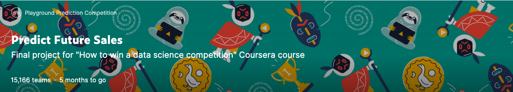

# Predict Future Sales
### 概要
このコンペはCourseraコースの「How to win a data science competition」の最終プロジェクトとして実施されている。

このコンペではロシア最大のソフトウェア会社の一つである**1C Company**から提供された毎日の売り上げデータからなる時系列データセットに取り組む。

次の月の全ての商品と店舗の総売上高を予測するのが目的である。

# 7/27
最近Kaggleのモチベが下がってきていたが[この記事](https://qiita.com/m-morohashi/items/de748dd6d4f04c34e8d8)を読み、購読した&士気が上がったので再度頑張ろうと思った。**継続は力なり**。  
業務が忙しくなってきたが、、少しでも知見を得てcommitしていきたい。