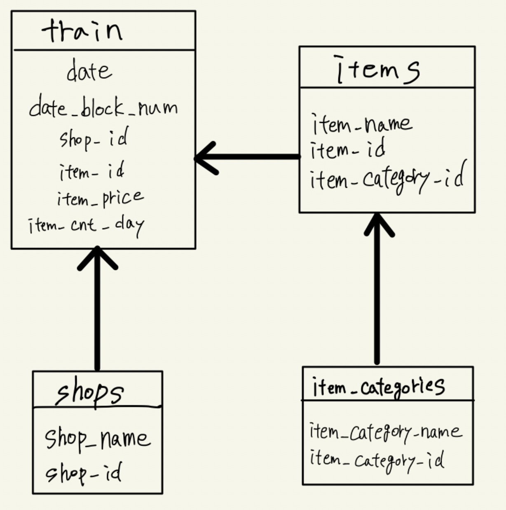
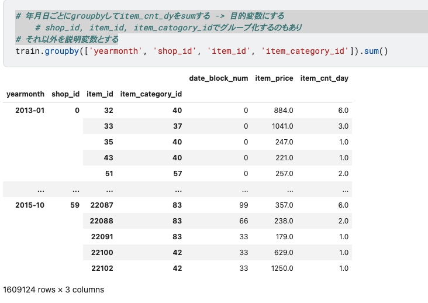

# Predict Future Sales
### 概要
このコンペはCourseraコースの「How to win a data science competition」の最終プロジェクトとして実施されている。

このコンペではロシア最大のソフトウェア会社の一つである**1C Company**から提供された毎日の売り上げデータからなる時系列データセットに取り組む。

* 目的
    * テストセット内の各IDについて、販売数の合計を予測する
    * 次の月の全ての商品と店舗の総売上高を予測する

# 7/27
最近Kaggleのモチベが下がってきていたが[この記事](https://qiita.com/m-morohashi/items/de748dd6d4f04c34e8d8)を読み、購読した&士気が上がったので再度頑張ろうと思った。**継続は力なり**。  
業務が忙しくなってきたが、、少しでも知見を得てcommitしていきたい。

# 7/28、7/29
* EDA
    * csvファイルが多いので各ファイルのサイズ確認
    * 欠損値、info情報の確認
    * https://www.kaggle.com/code/hikarumoriya/notebook9100e869d9/edit

# 8/1、8/2
* 評価方法
    * RMSE
    * 初めはLGBMでモデル作成する
* DFは全6つ
    * items
        * アイテムID
        * アイテムカテゴリID
        * アイテム名
    * item_categories
        * アイテムカテゴリID
        * アイテムカテゴリ名
    * shops
        * ショップID
        * ショップ名
    * train
        * 日付
        * date_block_num
        * ショップID
        * アイテムID
        * アイテム金額
        * アイテムカウント数/日
    * test
        * テストID
        * ショップID
        * アイテムID
    * submission
        * サブミットID(アイテムID)
        * アイテムカウント数/月  
* `pd.merge`で結合
    * 目的変数と説明変数を決定してLGBMで学習する

trainに対してitems, shops, item_categoriesをjoinして一つのDFにする。

# 8/3
* join後のtrainDFは日毎のアイテム販売数になっている
    * **groupbyで月毎の販売数カラムを追加する**
    * 2013~2015年までの各月の販売数を抽出することができる
    * これを元に翌月のアイテム販売数を予測することができるかも

* 年月日ごとにgroupbyしてitem_cnt_dayをsumする -> 目的変数にする
    * shop_id, item_id, item_catogory_idでグループ化するのもあり
* それ以外を説明変数とする

