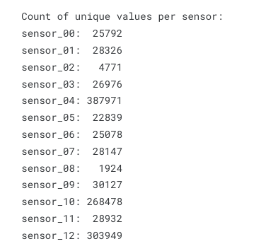
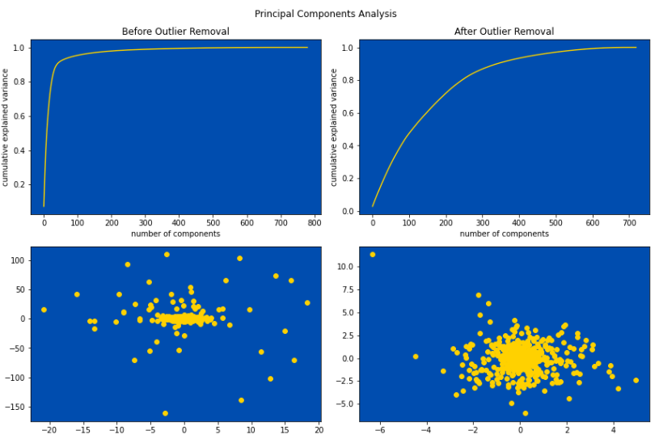

# Tabular Playground Series - Apr 2022

* 4月は時系列分類の課題

数百人の参加者から記録された60秒間の生体センサーデータで、2つの活動状態のどちらかにあった可能性のある数千のシーケンスが提供されています。あなたは、センサーデータから参加者がどのような状態であったかを判断することができますか？

このコンペティションでは、60秒間のセンサーデータを分類し、被験者がその間に2つの活動状態のどちらかにあったかを示します。

#### ファイルおよびフィールドの説明
* train.csv - 約1,000人の実験参加者の13種類の生体センサーを60秒間記録した約26,000件のトレーニングセット。
* sequence - 各シーケンスの一意のID
* subject - 実験に参加した被験者の一意のID。
* step - 録画の時間ステップ、1秒間隔
* sensor_00 - sensor_12 - その時間ステップにおける 13 個のセンサーのそれぞれの値
* train_labels.csv - 各シーケンスのクラスラベル．
* sequence - 各シーケンスの一意なID．
* state - 各シーケンスに関連付けられた状態．これは、予測しようとするターゲットである。
* test.csv - テストセット．約12,000個の配列のそれぞれについて、その配列の状態の値を予測する必要がある。
* sample_submission.csv - 正しいフォーマットで作成されたサンプル投稿ファイル。

# log
# 2022/04/05
* Most Votesの記事を見る(https://www.kaggle.com/code/ambrosm/tpsapr22-eda-which-makes-sense)
* はじめに
    * train, testのサイズshapeを確認する
    * 各カラムの最大最小を確認する
* Insight
    * train被験者とtest被験者が異なるので被験者を特徴量として扱えない
    * GroupKFold cross-validationを行うことがお勧め
    * 1シーケンスあたり780個の特徴量があるので、特徴量エンジニアリングが重要な役割を果たしそう

# 2022/04/06
昨日のInsightの続き

* 被験者が学習データ中に頻繁い出現するほど、その状態(state)=1の確率が高くなる
    * 被験者を特徴量として使ってはいけないが全ての被験者に属する配列の数をカウントして、この数を特徴量として使うべき(試したら予測値が向上したらしい)
* センサーに関して
    * 13個のセンサーについて、ヒストグラムをプロットする。ヒストグラムを見ると、どのセンサーにも外れ値があることがわかる。


* 外れ値に対処する必要がある。外れ値がある配列が数個しかない場合は、配列全体を削除することができる。もし、ほとんどの配列が外れ値を含んでいる場合、外れ値を削除するのではなく、より妥当な値で置き換える必要がある。つまり 外れ値がシングルステップなのかシーケンス全体なのかを把握することが重要である。

* 左右の2％の外れ値を取り除いたヒストグラム


* 訓練データは150万行以上あるが各センサーが返すユニークな値はかなり少ない
    * センサーが離散的な値を返すか、長時間間隔で一定の値を返すことが多いらしい
    * 参考までにセンサーごとのユニークな値のカウント
    

## 時系列に関して

ほとんどの時系列は、周波数が高い波形をしています。「周波数が高い」というのは、ほぼサンプリングステップごとに値が正負に変化することを意味します。
振幅が重要。シーケンス1（オレンジ色）では、ほとんどの波形が時系列の前半で後半よりも振幅が大きくなっている。シーケンス0（黄色）のいくつかのセンサーでは、時系列が終了する2、3ステップ前に振幅が増加する。
センサー_02（レベルが不連続のもの）は、時々しかレベルが変化しない。
少なくとも1つのシーケンス（番号15404）は一般的なパターンに従っておらず、そのセンサーのいくつかは一定の値を持つ。
sensor_12(一番下の図)の波形は、振幅が大きく変化している。1以下（シーケンス2）から500（シーケンス8364）まで。

* 何個かシーケンスをプロットしてみる

* 特徴量の解析では、この振り幅の変化を何らかの方法で検出する必要がある
    * 時系列の基本周波数を測定しても、あまり意味がない
    * sensor_02 の特徴抽出は、他のセンサーとは異な。一定ではない
    * 一定値を返すセンサーをチェックする必要があり、これは機能として使えるかも


## 一定値で止める
* 全てのセンサーについて、センサーが一定値に止まっているシーケンスを数えて平均ラベルを決定する

```python
# For every sensor: count the sequences where the sensor is stuck at a constant value
def stuck_at_constant(seq):
    return seq.min() == seq.max()

for sensor in range(13):
    sensor_name = f"sensor_{sensor:02d}"
    stuck_sequences = train.groupby('sequence')[sensor_name].apply(stuck_at_constant)
    print(f"{sensor_name}: {stuck_sequences.sum():4d}   {train_labels[stuck_sequences].state.mean()}")
```


* この方法は、1000以上の学習シーケンスに対して正しい予測を行うことができている

## PCA
EDAでは、通常、データの主成分を分析します。しかし、今回のように外れ値が多い場合、PCAでは誤魔化しが効かない。主成分は外れ値に支配されており、外れ値除去後のPCAは全く異なるものになります。

その効果は以下の図に示されています。外れ値除去前（左）は、最初の50の主成分がほとんどすべての分散を説明しているように見えます。外れ値除去後（右）は、最初の50個の主成分はほとんど何も説明していない。

外れ値が存在する場合、PCAには注意が必要です。
相関行列も同じような問題を抱えています。もし相関が見られたら、外れ値だけが相関しているのか、それともすべてのデータが相関しているのかを確認する必要があります。


## 次に何をするべきか
* EDAを理解した上で基本的に2つの選択肢がある
* ニューラルネットワークを構築する
* 特徴量エンジニアリングとgradient boostingで構築する


# 2022/04/07
* train.csv: 約1,000人の実験参加者の13種類の生体センサーを60秒間記録した約26,000件のトレーニングセット
* train_labels.csv: 各シーケンスのクラスラベル
* test.csv: テストセット．約12,000個の配列のそれぞれについて、その配列の状態の値を予測する必要がある
* このコンペの目的は何か
    * 目的
        * What: 参加者の活動状態を判別する(0 or 1)
        * When: 60秒間で計測されたデータ
        * Where: -
        * Who: 数百人の参加者
        * Why: -
        * How: 13個のセンサデータをもとに

* first submission
    * https://www.kaggle.com/code/hikarumoriya/simple-eda-and-predict-with-lightgbm

# 2022/04/08
* 公開NotebookのEDAとlightGBMを用いてsubmissionまで実行した
* tabular-playground-202204/simple-eda-and-predict-with-lightgbm.ipynb

# 2022/04/09
* Discussion, Notebookから得た情報をもとに日本語、英語のコメントをつけたNotebookを公開したら初めて銅メダルを獲得できた
* イチからコードを書いてオリジナルのソース・アルゴリズムを記述したわけではないが嬉しいしモチベーションにつながる
* ソースを書いて1行ずつ解釈していくうちに自然とモデリングできるようになっていたい

# 2022/04/10
* Discussionよりアイデア共有
    * データの分割方法
        * GroupStratifiedKFold (配列でグループ化するか、被験者でグループ化するか)
            * k分割交差検証
                * データをk個に分割して、n個を訓練用に 、k-n個をテスト用にする
                * 分けられたk個のデータが必ず1回はテスト用に使われるように繰り返す
                * sklearnを用いることで簡単に交差検証を使ってモデルを検証できる
                * 簡単な例(https://axa.biopapyrus.jp/machine-learning/model-evaluation/k-fold-cross-validation.html)

    * 特徴エンジニアリング
        * シフト(1)またはシフト(-1)を使用して、特定の特徴に遅延特徴を作成する
            * シフト(1)とは？
        * 特定の素性に対して cumsum() を使用する
            * pd.cumcum() : 累積和
        * 特定のフィーチャーにdiff( )を使用する
            * デフォルトでは1行前の値との差分が算出される
        * シーケンス、サブジェクトなどの特定のグループにおける最大値、平均値などの基本統計情報を計算する
        * ※なお、上記の特徴量を計算するためには、正確にgroupby()を使用できているか確認する
    * モデリング手法
        * LSTM
        * CNN Transformer

# 2022/04/11
* 公開したNotebookの日本語訳付け
* Model作成時のparamの復習

    
### [LSTM Tutorial](https://www.kaggle.com/code/javigallego/tps-apr22-eda-fe-lstm-tutorial)の洞察
* Submissionは予測された確率と観測されたターゲットとの間の**ROC**曲線下面積で評価される
* そもそもROCとは何か？

#### ROC
統計用語である。検査や診断薬の性能を2次元のグラフに表したもの。当該検査で異常と正常を区別するカットオフポイントごとに真陽性率（=TPF）と偽陽性率（=FPF）を計算し、縦軸にTPF、横軸にFPFをとった平面にプロットして線で結んで表す。

ROC曲線を作成した時に、グラフの下の部分の面積をAUC（Area Under the Curve）とよぶ。AUCは0から1までの値をとり、値が1に近いほど判別能が高いことを示す。


# 2022/04/12
* 昨日、[Notebook](https://www.kaggle.com/code/hikarumoriya/simple-eda-and-predict-with-lightgbm)にコメントをもらった
* モデルから推測される予測結果の出し方自体は間違っていないが、このコンぺの提出物として正しいのは[0, 1]の2値を求めることである。自分が出力したものは0~1の値(少数を含む)を取る予測出力結果だ。この部分を[0, 1]の近い方にintでキャストすると、点数が向上するかも？と指摘いただいたので試してみる。
* 結果
    
    
    * 精度は向上しなかった -> 逆に下がった
    * intでキャストするよりも0~1で予測したfloatの方が良い結果になった
    * 知識が浅いせいか、もしくは方法が違うのかもしれないがわからなかった

# 2022/04/13
* 質問内容

```
ハイパーパラメータチューニング前のaucスコアはどんなものだったのか？
```
* ハイパーパラメータ
    * 「どれくらい非線形か」「過学習と未学習」などのバランスは実際のデータに合わせて**学習とは別途調整する必要がある**
    * これらのバランスを調整するためのパラメータを、**ハイパーパラメータ**と言う
    * -> パラメータをチューニングすることで未知データに対する推定精度を向上させる

* AUC(area under curve)
    * 簡単に言うと曲線直下の面積のこと
    * ROC曲線におけるAUCは以下の部分のことを指す
    

#### どう回答するか
学習前のROC曲線と学習後のROC曲線をプロットする。
また、その時のAUCを求めたい。

まずはROC曲線をプロットしてみる。
* ROC曲線描画の参考になりそうなNotebook
    * https://www.kaggle.com/code/ambrosm/tpsapr22-best-model-without-nn
    * https://www.kaggle.com/code/aboriginal3153/tps-apr-22-neural-network-using-pytorch

# 2022/04/14
* ROC曲線のプロットしたNotebookの読む
* lgbmによるroc, rmseの評価方法↓
* https://ryucoding.com/programming/evaluate-method-lightgbm

# 2022/04/15
* roc.mdの記述
* ROC曲線・AUCについて詳しく記述した

# 2022/04/16
* 翌日応用情報処理試験なのでお休み

# 2022/04/18
#### 特徴量エンジニアリングの失敗例6選
* https://www.kaggle.com/competitions/tabular-playground-series-apr-2022/discussion/318527

1. 創造性が足りない。センサーの平均値、中央値、最小値、最大値、標準偏差で集計しているが今の競技で上位を取るにはこの情報だけでは不十分。平均値、標準偏差に次いで歪度・尖度も試してみるのが自然。歪度は今回はあまり機能していないがsensor_04の尖度が重要な機能となりそう（？）


2. 集計項目が重なる。
3. 特徴量選択がない。モデルに多くの特徴を与えすぎるとスコアが悪化する。sequential feature selection？permutation feature selection？を利用すると結構いいらしい。
4. 被験者のシーケンス情報を使わない。特徴量としてはあまり良くない。
5. クロスバリデーションにおけるデータリーク(機械学習で入ってはいけないデータが混入する)。KfoldやStratifiedKfoldは使わない。今回のコンペではtrainとtestの被験者がバラバラなので、モデルが見た事のない被験者にも汎化できることを検証する必要がある。GroupKfoldで`groups=train.subject`とすることでtrainに登場しない被験者から検証セットを構成することができる。
6. ランダムフォレスト分類器(RandomForestClassifier)。ランダムフォレストはいい結果が出やすい。gbdt(gradient boosted decision trees)より良いかも。HistGradientBoostingClassifier, XGBoost, CatBoost, LightGBMから好きなものを選べる。

# 2022/04/19
* roc.mdの更新(超大作になってきた)

# 2022/04/20
* Kaggleで正規化したデータフレームの作成
    * 平均値
    * 中央値
    * 最小値
    * 最大値
    * 標準偏差
    * 歪度
    * 尖度
    * lgbm

# 2022/04/21
* Kaggleで正規化したデータフレームの作成
* 尖度の求め方は`df.kurt()`ではない。
    * `df.apply(pd.DataFrame.kurt)`とする必要がある
* lightgbmはKaggleスタートブックに喜寿していた`train_test_split`を使用する方法で書いた

# 2022/04/22
* 昨日一昨日書いたnotebookの提出
* 結果は精度の低いスコアになった


# 2022/04/23
* Discussion
    * LGBMの参考になりそうなNotebook
    * https://www.kaggle.com/code/hasanbasriakcay/tpsapr22-optuna-lgbm-blend

# 2022/04/24
* 平均値や標準偏差など基本的な指標を使って80％超えのスコアを叩き出したNoteboook
    * https://www.kaggle.com/code/himankkavathekar/basic-signal-stats-rf-model
    * 求め方等参考になりそう
* 4/22に提出した精度の低いNotebookを改善する
    * 本コンペは外れ値の多いデータなので外れ値を除外してみる
    * 外れ値の除外をするだけで結構スコアが良くなった
    * どのくらい外れ値を除外するのが正しいのかも検討する必要がある
    * 
    * 外れ値を除外するのではなく中央値`df.median()`で補間してみると多少スコアが上がった
    * 
    * https://www.kaggle.com/competitions/tabular-playground-series-apr-2022/submissions
    * 四分位数の範囲の決め方と補間方法で多少スコアが向上しそう