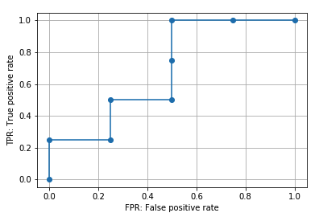

# scikit-learnでROC曲線とそのAUCを算出

## ROC and AUC
* Receiver operating characteristic(受信者操作特性)の略
* Area Under the Curveの略
* セットで用いられることが多い
* Area under an ROC curve(ROC曲面下の面積)をROCーAUCと呼ぶ
* scikit-learnを使うと、ROC曲線を算出・プロットしたりROCーAUCスコアを算出できる

ここでは以下についての説明を行う。
* ROC曲線の算出・プロット：`roc_curve()`
* ROC曲線の意味
    * FPR(偽陽性率)とTPR(真陽性率)
    * ROC曲線の種類
* ROC曲線の特徴と注意点
    * ROC曲線に影響するのは予測スコアの順番のみ（順位）
    * ランダムに分類した場合のROC曲線
* AUCの意味
* ROC-AUCスコアの算出：`roc_auc_score()`

※混同行列等の説明は[こちら](https://note.nkmk.me/python-sklearn-confusion-matrix-score/)

---

## ROC曲線の算出・プロット：`roc_curve()`
ROC曲線の算出には`sklearn.metrics`モジュールの`roc_curve()`関数を使う。
第一引数に正解クラス、第二引数に予測スコアクラスのリストや配列をそれぞれ指定する。

予測スコアは機械学習のモデルなどによって予測された確率で、例えば1.0だと100％の確率で1だと予測、0.8だと80％の確率で1だと予測していると言う意味合いの値。

roc_curve()は3つの要素をも持つタプルを返す。

```python
from sklearn.metrics import roc_curve
import matplotlib.pyplot as plt

y_true = [0, 0, 0, 0, 1, 1, 1, 1]
y_score = [0.2, 0.3, 0.6, 0.8, 0.4, 0.5, 0.7, 0.9]

roc = roc_curve(y_true, y_score)

print(type(roc))
# <class 'tuple'>

print(len(roc))
# 3
```

3つの要素は順番にfpr, tpr, thresholdsで、それぞれFPR(偽陽性率), TPR(真陽性率), 閾値を表している。
ここではアンパックでそれぞれの変数に格納して中身を確認する。

(アンパック: 複数の変数に展開して代入すること)

```py
fpr, tpr, thresholds = roc_curve(y_true, y_score)

print(fpr)
# [0.   0.   0.25 0.25 0.5  0.5  1.  ]

print(tpr)
# [0.   0.25 0.25 0.5  0.5  1.   1.  ]

print(thresholds)
# [1.9 0.9 0.8 0.7 0.6 0.4 0.2]
```

この`fpr`横軸、`tpr`を縦軸にプロットしたものを**ROC曲線**と呼ぶ
```py
plt.plot(fpr, tpr, marker='o')
plt.xlabel('FPR: False positive rate')
plt.ylabel('TPR: True positive rate')
plt.grid()
```


`roc_curve()`関数はデフォルトでROC曲線の形状に影響しない点を省略(除外)するようになっている。引数`drop_intermediate`を`False`にすると全ての点が除外されずに算出される。
```py
fpr_all, tpr_all, thresholds_all = roc_curve(y_true, y_score,
                                             drop_intermediate=False)

print(fpr_all)
# [0.   0.   0.25 0.25 0.5  0.5  0.5  0.75 1.  ]

print(tpr_all)
# [0.   0.25 0.25 0.5  0.5  0.75 1.   1.   1.  ]

print(thresholds_all)
# [1.9 0.9 0.8 0.7 0.6 0.5 0.4 0.3 0.2]

plt.plot(fpr_all, tpr_all, marker='o')
plt.xlabel('FPR: False positive rate')
plt.ylabel('TPR: True positive rate')
plt.grid()
plt.savefig('data/dst/sklearn_roc_curve_all.png')
```


また陽性クラスを指定するための引数`pos_label`もある。0 or 1の2値分類の場合は気にする必要はないが、そのほかのクラス(ラベル)を使うときは`pos_label`を明示的に指定する必要がある。

## ROC曲線の意味
正解クラスと予測スコアが与えられた時、各予測スコアを閾値とした時のFPR(偽陽性率)を横軸, TPR(真陽性率)を縦軸にプロットしたものがROC曲線。

↑だとあまりイメージが掴めないので順を追って見ていく。
上の例と同じ正解クラス、予測スコアをNumpy配列`ndarray`として定義する。
```py
from sklearn.metrics import roc_curve, recall_score, confusion_matrix
import matplotlib.pyplot as plt
import numpy as np
import pandas as pd

y_true = np.array([0, 0, 0, 0, 1, 1, 1, 1])
y_score = np.array([0.2, 0.3, 0.6, 0.8, 0.4, 0.5, 0.7, 0.9])
```

### FPR(偽陽性率)とTPR(真陽性率)
予測スコアはあくまでも確率なので、0 or 1を判定し分類するには閾値を設定する必要がある。
例えば0.5を閾値としてそれ以上を1と判定すると結果は以下のようになる。

`ndarray`を比較絵演算子で比較すると`bool`の`ndarray`が得られるのでそれを`astype()`で整数`int`にキャストしている。`int`に変換しているのは表示上みやすくするためなので、計算する上では`bool`のままで問題ない。(Falseが0、Trueが1)

```py
print(y_score >= 0.5)
# [False False  True  True False  True  True  True]

print((y_score >= 0.5).astype(int))
# [0 0 1 1 0 1 1 1]
```

0 or 1の判定結果が得られると、それを正解クラスと比較することでFPRやTPRを算出できる。
* FPR: flase oisitive rate（偽陽性率）
    * 陰性を間違って陽性と判定した割合
        * 小さい方がいい
    * `FPR = FP / (FP + TN)`
* TPR: true positive rate（真陽性率）
    * 陽性を正しく陽性と判定した割合
        * 大きい方がいい
    * recall(再現率)やsensitivity, hit rateなどとも呼ばれる
    * `TPR = TP / (TP + FN)`

ここでTP, TN, FP, FNの意味は以下の通り。それぞれの個数からFPR, TPRを算出する
* 真陽性（TP: True Positive）: 実際のクラスが陽性で予測も陽性（正解）
* 真陰性（TN: True Negative）: 実際のクラスが陰性で予測も陰性（正解）
* 偽陽性（FP: False Positive）: 実際のクラスは陰性で予測が陽性（不正解）
* 偽陰性（FN: False Negative）: 実際のクラスは陽性で予測が陰性（不正解）

参考(模写) -> https://note.nkmk.me/python-sklearn-roc-curve-auc-score/