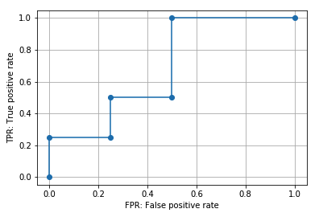

# scikit-learnでROC曲線とそのAUCを算出

## ROC and AUC
* ROC : Receiver operating characteristic(受信者操作特性)の略
* AUC : Area Under the Curveの略
* セットで用いられることが多い
* Area under an ROC curve(ROC曲面下の面積)をROCーAUCと呼ぶ
* scikit-learnを使うと、ROC曲線を算出・プロットしたりROCーAUCスコアを算出できる

ここでは以下についての説明を行う。
* ROC曲線の算出・プロット：`roc_curve()`
* ROC曲線の意味
    * FPR(偽陽性率)とTPR(真陽性率)
    * ROC曲線の種類
* ROC曲線の特徴と注意点
    * ROC曲線に影響するのは予測スコアの順番のみ（順位）
    * ランダムに分類した場合のROC曲線
* AUCの意味
* ROC-AUCスコアの算出：`roc_auc_score()`

※混同行列等の説明は[こちら](https://note.nkmk.me/python-sklearn-confusion-matrix-score/)

---

## ROC曲線の算出・プロット：`roc_curve()`
ROC曲線の算出には`sklearn.metrics`モジュールの`roc_curve()`関数を使う。
第一引数に正解クラス、第二引数に予測スコアクラスのリストや配列をそれぞれ指定する。

予測スコアは機械学習のモデルなどによって予測された確率で、例えば1.0だと100％の確率で1だと予測、0.8だと80％の確率で1だと予測していると言う意味合いの値。

roc_curve()は3つの要素をも持つタプルを返す。

```python
from sklearn.metrics import roc_curve
import matplotlib.pyplot as plt

y_true = [0, 0, 0, 0, 1, 1, 1, 1]
y_score = [0.2, 0.3, 0.6, 0.8, 0.4, 0.5, 0.7, 0.9]

roc = roc_curve(y_true, y_score)

print(type(roc))
# <class 'tuple'>

print(len(roc))
# 3
```

3つの要素は順番にfpr, tpr, thresholdsで、それぞれFPR(偽陽性率), TPR(真陽性率), 閾値を表している。
ここではアンパックでそれぞれの変数に格納して中身を確認する。

(アンパック: 複数の変数に展開して代入すること)

```py
fpr, tpr, thresholds = roc_curve(y_true, y_score)

print(fpr)
# [0.   0.   0.25 0.25 0.5  0.5  1.  ]

print(tpr)
# [0.   0.25 0.25 0.5  0.5  1.   1.  ]

print(thresholds)
# [1.9 0.9 0.8 0.7 0.6 0.4 0.2]
```

この`fpr`横軸、`tpr`を縦軸にプロットしたものを**ROC曲線**と呼ぶ
```py
plt.plot(fpr, tpr, marker='o')
plt.xlabel('FPR: False positive rate')
plt.ylabel('TPR: True positive rate')
plt.grid()
```


`roc_curve()`関数はデフォルトでROC曲線の形状に影響しない点を省略(除外)するようになっている。引数`drop_intermediate`を`False`にすると全ての点が除外されずに算出される。
```py
fpr_all, tpr_all, thresholds_all = roc_curve(y_true, y_score,
                                             drop_intermediate=False)

print(fpr_all)
# [0.   0.   0.25 0.25 0.5  0.5  0.5  0.75 1.  ]

print(tpr_all)
# [0.   0.25 0.25 0.5  0.5  0.75 1.   1.   1.  ]

print(thresholds_all)
# [1.9 0.9 0.8 0.7 0.6 0.5 0.4 0.3 0.2]

plt.plot(fpr_all, tpr_all, marker='o')
plt.xlabel('FPR: False positive rate')
plt.ylabel('TPR: True positive rate')
plt.grid()
plt.savefig('data/dst/sklearn_roc_curve_all.png')
```


また陽性クラスを指定するための引数`pos_label`もある。0 or 1の2値分類の場合は気にする必要はないが、そのほかのクラス(ラベル)を使うときは`pos_label`を明示的に指定する必要がある。

## ROC曲線の意味
正解クラスと予測スコアが与えられた時、各予測スコアを閾値とした時のFPR(偽陽性率)を横軸, TPR(真陽性率)を縦軸にプロットしたものがROC曲線。

↑だとあまりイメージが掴めないので順を追って見ていく。
上の例と同じ正解クラス、予測スコアをNumpy配列`ndarray`として定義する。
```py
from sklearn.metrics import roc_curve, recall_score, confusion_matrix
import matplotlib.pyplot as plt
import numpy as np
import pandas as pd

y_true = np.array([0, 0, 0, 0, 1, 1, 1, 1])
y_score = np.array([0.2, 0.3, 0.6, 0.8, 0.4, 0.5, 0.7, 0.9])
```

### FPR(偽陽性率)とTPR(真陽性率)
予測スコアはあくまでも確率なので、0 or 1を判定し分類するには閾値を設定する必要がある。
例えば0.5を閾値としてそれ以上を1と判定すると結果は以下のようになる。

`ndarray`を比較絵演算子で比較すると`bool`の`ndarray`が得られるのでそれを`astype()`で整数`int`にキャストしている。`int`に変換しているのは表示上みやすくするためなので、計算する上では`bool`のままで問題ない。(Falseが0、Trueが1)

```py
print(y_score >= 0.5)
# [False False  True  True False  True  True  True]

print((y_score >= 0.5).astype(int))
# [0 0 1 1 0 1 1 1]
```

0 or 1の判定結果が得られると、それを正解クラスと比較することでFPRやTPRを算出できる。
* FPR: flase oisitive rate（偽陽性率）
    * 陰性を間違って陽性と判定した割合
        * 小さい方がいい
    * `FPR = FP / (FP + TN)`
* TPR: true positive rate（真陽性率）
    * 陽性を正しく陽性と判定した割合
        * 大きい方がいい
    * recall(再現率)やsensitivity, hit rateなどとも呼ばれる
    * `TPR = TP / (TP + FN)`

ここでTP, TN, FP, FNの意味は以下の通り。それぞれの個数からFPR, TPRを算出する
* 真陽性（TP: True Positive）: 実際のクラスが陽性で予測も陽性（正解）
* 真陰性（TN: True Negative）: 実際のクラスが陰性で予測も陰性（正解）
* 偽陽性（FP: False Positive）: 実際のクラスは陰性で予測が陽性（不正解）
* 偽陰性（FN: False Negative）: 実際のクラスは陽性で予測が陰性（不正解）

#### コードによるFPR, TPRの算出方法
FPRを算出する関数を定義する。**0.5**を閾値とした場合のFPRは以下。
なお、この関数は簡易的なもので0 or 1 の二値分類で0を陰性、1を陽性とする場合にのみ対応している。
```python
def fpr_score(y_true, y_pred):
    tn, fp, fn, tp = confusion_matrix(y_true, y_pred).flatten()
    return fp / (tn + fp)

print(fpr_score(y_true, y_score >= 0.5))
# 0.5
```

TPRを算出する場合、scikit-learnの`recall_score()`がそのまま使える。
```python
print(recall_score(y_true, y_score >= 0.5))
# 0.75
```


FPR, TPRのイメージを掴むために閾値を極端に振った場合を考える。
閾値を予測スコアの最小値とすると全てのスコアが1（陽性）と判定される。この場合、陽性も陰性も全て陽性と判定している状態のなので、FPRもTPRも1になる。
```python
th_min = min(y_score)
print(th_min)
# 0.2

print((y_score >= th_min).astype(int))
# [1 1 1 1 1 1 1 1]

print(fpr_score(y_true, y_score >= th_min))
# 1.0

print(recall_score(y_true, y_score >= th_min))
# 1.0
```

また、全ての予測スコアを閾値とした場合のFPRとTPRを算出してみる。pandasの`apply()`メソッドを使っている。

```python
df = pd.DataFrame({'true': y_true, 'score': y_score})

df['TPR'] = df.apply(lambda row: recall_score(y_true, y_score >= row['score']), axis=1)
df['FPR'] = df.apply(lambda row: fpr_score(y_true, y_score >= row['score']), axis=1)

print(df)
#    true  score   TPR   FPR
# 0     0    0.2  1.00  1.00
# 1     0    0.3  1.00  0.75
# 2     0    0.6  0.50  0.50
# 3     0    0.8  0.25  0.25
# 4     1    0.4  1.00  0.50
# 5     1    0.5  0.75  0.50
# 6     1    0.7  0.50  0.25
# 7     1    0.9  0.25  0.00
```

予測スコアで降順にソートすると以下の通り。
```python
print(df.sort_values('score', ascending=False))
#    true  score   TPR   FPR
# 7     1    0.9  0.25  0.00
# 3     0    0.8  0.25  0.25
# 6     1    0.7  0.50  0.25
# 2     0    0.6  0.50  0.50
# 5     1    0.5  0.75  0.50
# 4     1    0.4  1.00  0.50
# 1     0    0.3  1.00  0.75
# 0     0    0.2  1.00  1.00
```

ここで`roc_curve()`関数が返す`fpr`, `tpr`, `thresholds`を確認する。(thresholds=閾値)

`drop_intermediate=False`として省略しないようにしている。
(すべての点が省略されずに算出される)
```python
fpr_all, tpr_all, th_all = roc_curve(y_true, y_score,
                                     drop_intermediate=False)

df_roc = pd.DataFrame({'th_all': th_all, 'tpr_all': tpr_all, 'fpr_all': fpr_all})

print(df_roc)
#    th_all  tpr_all  fpr_all
# 0     1.9     0.00     0.00
# 1     0.9     0.25     0.00
# 2     0.8     0.25     0.25
# 3     0.7     0.50     0.25
# 4     0.6     0.50     0.50
# 5     0.5     0.75     0.50
# 6     0.4     1.00     0.50
# 7     0.3     1.00     0.75
# 8     0.2     1.00     1.00
```

2行目以降は上で算出したものと一致している、1行目は予測スコアの最大値に1を加えたものを閾値としてそのFPR、TPRを算出している。最大値に1を加えるのは、全ての予測スコアを0（陰性）と判定してFPR、TPRも0となるポイントを追加するため。

上でも示したようにこの`fpr`を横軸、`tpr`を縦軸にプロットしたものが**ROC曲線**になる。


## 様々なROC曲線(種類)
ROC曲線が何を意味しているのか、ROC曲線から何がわかるのか考える。

理想的な例として適切な閾値を設定すると0（陰性）、1（陽性）を完全に分類できる場合を考える。
```python
y_true_perfect = np.array([0, 0, 0, 0, 1, 1, 1, 1])
y_score_perfect = np.array([0.1, 0.2, 0.3, 0.4, 0.5, 0.6, 0.7, 0.8])
```
この例では閾値を`0.5`とすると完全に正しく分類できる。0.45でもいいがここでは予測スコアに存在する値を使う。

```python
print(y_true_perfect)
# [0 0 0 0 1 1 1 1]

print((y_score_perfect >= 0.5).astype(int))
# [0 0 0 0 1 1 1 1]
```

この理想的な状態ではFPRは0、TPRは1となる。
```python
print(fpr_score(y_true_perfect, y_score_perfect >= 0.5))
# 0.0

print(recall_score(y_true_perfect, y_score_perfect >= 0.5))
# 1.0
```
ROC曲線をプロットすると以下のようになる。
```python
roc_p = roc_curve(y_true_perfect, y_score_perfect, drop_intermediate=False)

plt.plot(roc_p[0], roc_p[1], marker='o')
plt.xlabel('FPR: False positive rate')
plt.ylabel('TPR: True positive rate')
plt.grid()
```


理想的な例から正解ラベルを変更して、完全に正しく分類できる閾値が存在しない場合のROC曲線を追加する。
```python
y_true_1 = np.array([0, 0, 0, 1, 0, 1, 1, 1])
y_score_1 = y_score_perfect

roc_1 = roc_curve(y_true_1, y_score_1, drop_intermediate=False)

y_true_2 = np.array([0, 0, 1, 1, 0, 0, 1, 1])
y_score_2 = y_score_perfect

roc_2 = roc_curve(y_true_2, y_score_2, drop_intermediate=False)

plt.plot(roc_p[0], roc_p[1], marker='s')
plt.plot(roc_1[0], roc_1[1], marker='o')
plt.plot(roc_2[0], roc_2[1], marker='x')
plt.xlabel('FPR: False positive rate')
plt.ylabel('TPR: True positive rate')
plt.grid()
```


このグラフから、ROC曲線は
* 理想的な予測（分類）ができていると（FPR, TPR）＝（0, 1）（左上の点）を通る
* 理想的な予測から外れると（FPR, TPR）＝（0, 1）（左上の点）から離れていく

ことがわかる。ROC曲線が左上に膨らむほど正しく予測ができていると言うイメージ。

正しく予測できていると閾値を大きくしていった時にFPRが小さいままTPRが大きくなっていき、正しく予測できていないと閾値を大きくしていったときに、TPRが小さいままFPRが大きくなっていく。ROC曲線はそのようなFPRとTPRの関係を図示したものと考えることもできる。

**これを数値化するために、ROC曲線のAUC（曲線下の面積）を算出する方法がある。**

参考 : https://note.nkmk.me/python-sklearn-roc-curve-auc-score/