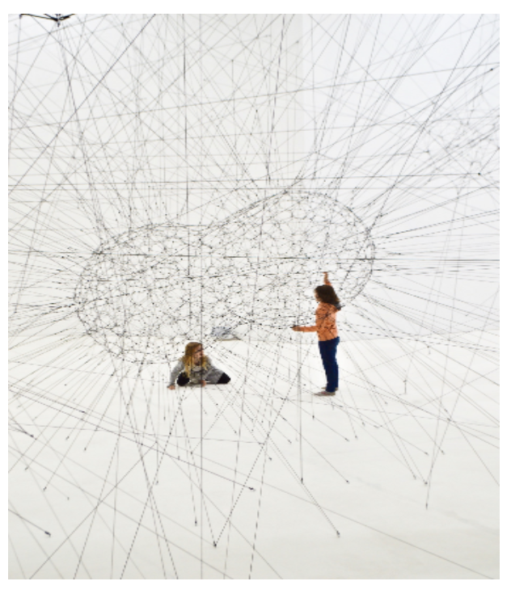

# 2022/05
多くの特徴量を含む2値分類問題。
33個のカラム(特徴)がある。

# log
# 5/9
* pandas profileを使ってデータの調査
* どんなデータが与えられているか確認

# 5/10
* Get Started EDA
* https://www.kaggle.com/code/calebreigada/getting-started-eda-preprocessing

# 5/11
* 日本語のEDA
* PyTorchを使ったニューラルネットワーク
* https://www.kaggle.com/code/aboriginal3153/ver-tps-mar-22-neural-network-with-pytorch