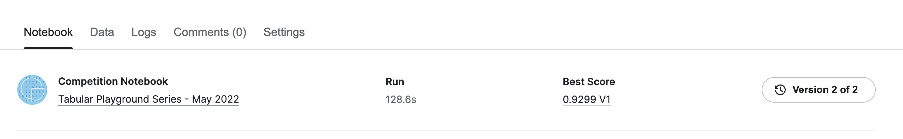
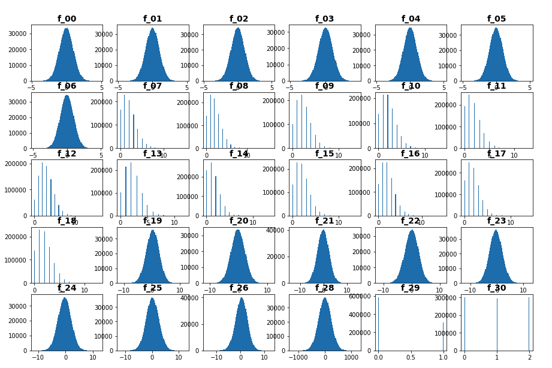
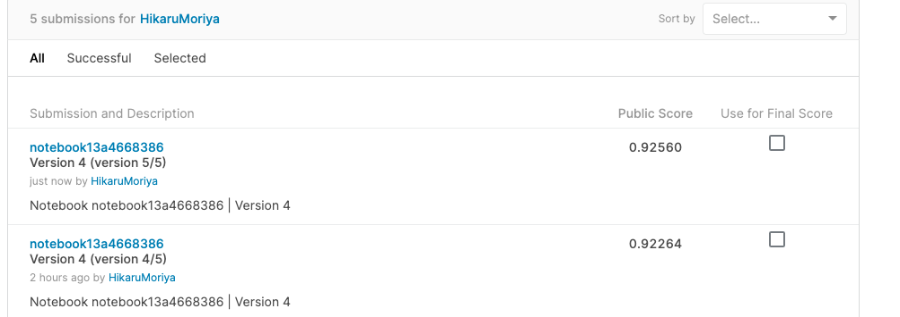
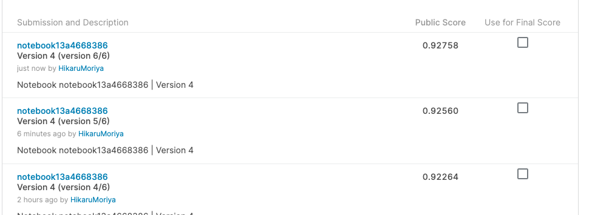
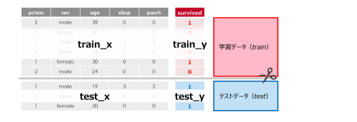

# 2022/05
多くの特徴量を含む2値分類問題。
33個のカラム(特徴)がある。


# log
# 5/9
* pandas profileを使ってデータの調査
* どんなデータが与えられているか確認

# 5/10
* Get Started EDA
* https://www.kaggle.com/code/calebreigada/getting-started-eda-preprocessing

# 5/11
* 日本語のEDA
* PyTorchを使ったニューラルネットワーク
* https://www.kaggle.com/code/aboriginal3153/ver-tps-mar-22-neural-network-with-pytorch

# 5/12
* LightGBMの初回submit
* https://www.kaggle.com/code/hikarumoriya/simple-lightgbm
* 
* Score: 0.9299 (LB Score: 0.99830)
* こちらもニューラルネットワークだけど分かりやすいNoteBook
    * https://www.kaggle.com/code/kellibelcher/tps-may-2022-eda-lgbm-neural-networks
* matplotlibでf_00からf_30までのデータをヒストグラム化

 # 5/15
 * matplotlibでf_00からf_30までのデータをヒストグラム化する
   * plot.showが処理遅くてグラフがプロットできない
     * 描画に時間がかかる？

# 5/16
### 今日のdiscussion
* トップ3の特徴量エンジニア

Interaction vs Correlationのトピックで、@wti200は、特徴空間のある投影が、ターゲット確率の異なる3つの領域に分割されることを示た。これらの図から、特徴の相互作用を導き出すことができる。特に、3つの投影が有効である。

* f_02とf_21への射影
* f_05とf_22への射影
* f_00+f_01への投影とf_26への投影

# 5/17
### 今日のdiscussion
* a little finding about f_27

有益な情報かどうかわからないが配列を一通り見てP、Q、R、S、Tの文字が常に配列の8文字目にあることがわかった。しかも、それらの文字が最後の位置に配置されることはないらしい。

* plot.showが遅い理由(?)
  * 単純にプロット数が多くて間に合っていなかった
  * f_27カラムがカテゴリ変数だったのでグラフ描画できなかった
  * `fig, ax = plt.subplots(5, 6)`として`ax[0, 0], ax[0, 1]`のように描画するindex番号を割り振る必要があった
    * 

* これが一番分かりやすいEDAだったので解読していく
  * https://www.kaggle.com/code/calebreigada/getting-started-eda-preprocessing

# 5/18
* pandas100本ノック(50/100)

# 5/19
* pandas100本ノック(60/100)

# 5/20
* Notebook
  * 日本語表記もあり分かりやすいNotebook
  * https://www.kaggle.com/code/akioonodera/tps-may2022-lgbm-binary
* Discussion
  * クロスバリデーションのアドバイス参考になりそう
  * https://www.kaggle.com/competitions/tabular-playground-series-may-2022/discussion/323417

# 5/22
* 日本語訳して実行してみる
  * https://www.kaggle.com/code/hasanbasriakcay/tpsmay22-insightful-eda-fe-baseline

# 5/23
* 昨日の日本語訳↓
* https://www.kaggle.com/hikarumoriya/tpsmay22-insightful-eda/edit

# 5/26
* LabelEncoderとLightGBMだけを用いた簡単な結果提出
* https://www.kaggle.com/code/hikarumoriya/notebook13a4668386?scriptVersionId=96620236
* 
* lgbmの`num_boost_round`を1000回から1500回に増やした時制度はどのくらい変わるのか試してみた
  * 0.92264 -> 0.92560
  * 0.03だけ精度が向上した
  * 
* lgbmの`num_boost_round`を1500回から2000回に増やした時制度はどのくらい変わるのか試してみた
  * 0.92560 -> 0.92758
  * 0.02だけ精度向上
  * 
* 少しずつだが精度は上がっている

# 5/27
## 現状の学習内容

f_27の特徴をLabelEncodeして`f_01`〜`f_30`をfeature(説明変数)、`target`をtarget(目的変数)とした。
sklearnの`train_test_split`を使って訓練用とテスト用にデータ分割した。`test_size`を0.3にして訓練：テスト = 7 : 3に分けた。
* 訓練データ：一般的にX_train, y_trainで定義することが多い
* テストデータ：一般的にX_test, y_testで定義することが多い
* 

(↑一度学習したデータをテストしても意味がない、答えを覚えてしまっているから。

このように学習で用いていないデータを利用することでモデルの精度を測定する。なので機械学習では学習用とテスト用のデータが必要になる)

次にLGBMを用いて勾配ブースティングをする。

まずはLightGBMに訓練用よテスト(検証)用データをセットする。
ここで検証用として扱うのであればDatasetに`reference=lgb_train`を追加する必要がある。
```
lgb_train = lgb.Dataset(train_X, train_y)
lgb_test = lgb.Dataset(test_x, test_y, reference=lgb_train)
```

#### LightGBMのハイパパラメータを設定する
（設定できるパラメータはたくさんある→ https://lightgbm.readthedocs.io/en/latest/Parameters.html ）

```python
params = {'task': 'train',              # タスクを訓練に設定
          'boosting_type': 'gbdt',      # GBDTを指定
          'objective': 'multiclass',    # 多クラス分類を指定
          'metric': {'multi_logloss'},  # 多クラス分類の損失（誤差）
          'num_class': 3,               # クラスの数（irisデータセットが3個のクラスなので）
          'learning_rate': 0.1,         # 学習率
          'num_leaves': 21,             # ノードの数
          'min_data_in_leaf': 3,        # 決定木ノードの最小データ数
          'num_iteration': 100}         # 予測器(決定木)の数:イタレーション
```

なお、今回は簡易的なので`metric`だけを`rmse`に指定した。

#### LightGBMで学習する
LightGBMでは`lgb.train`で訓練を行う。

```python
model = lgb.train(params=params,                    # ハイパーパラメータをセット
                  train_set=lgb_train,              # 訓練データを訓練用にセット
                  valid_sets=[lgb_train, lgb_test], # 訓練データとテストデータをセット
                  valid_names=['Train', 'Test'],    # データセットの名前をそれぞれ設定
                  num_boost_round=100,              # 計算回数
                  early_stopping_rounds=10,         # 学習が収束した時に自動的に学習を止めてくれる
                  evals_result=lgb_results)         # 履歴を保存する
```

最良の予測器が得られたイタレーション数を予測値に入れる。
```python
y_pred = model.predict(X_test, num_iteration=model.best_iteration)
```

以上で予測値を求めることができた。

---
