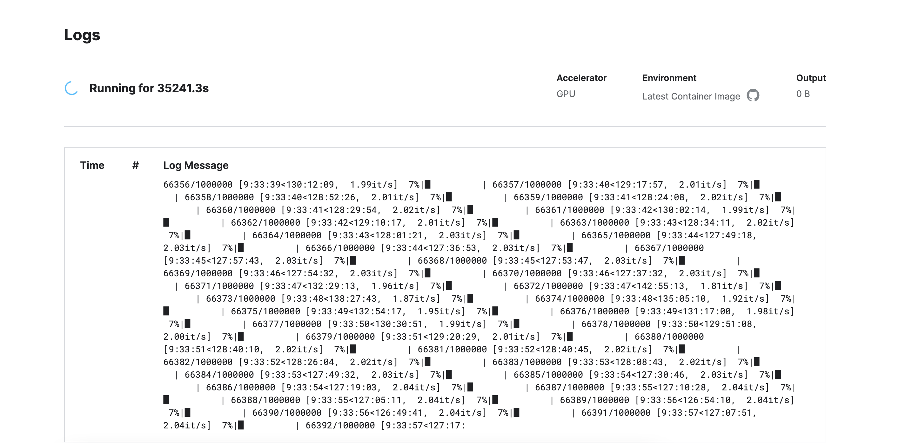
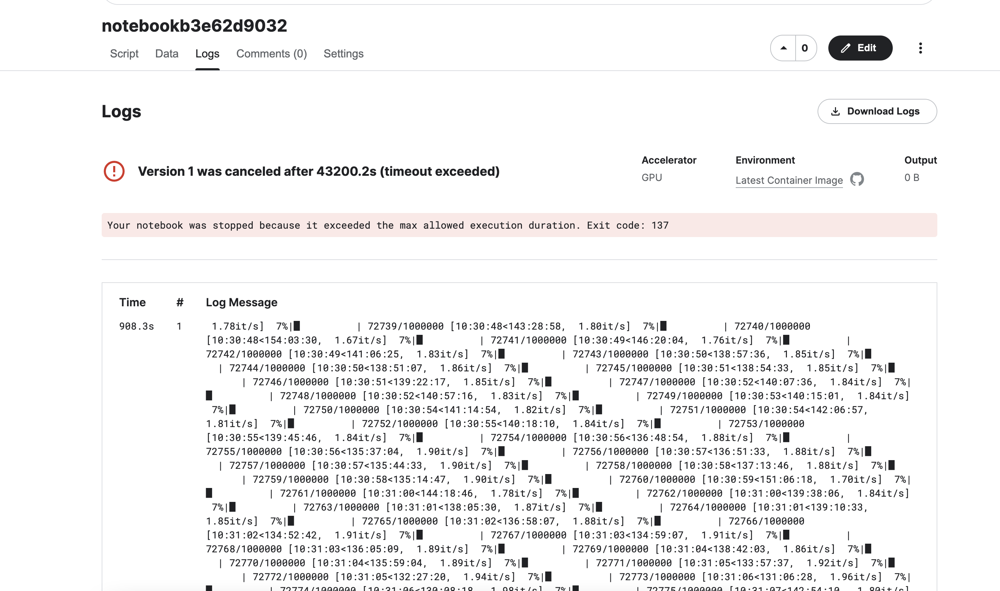
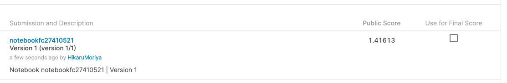
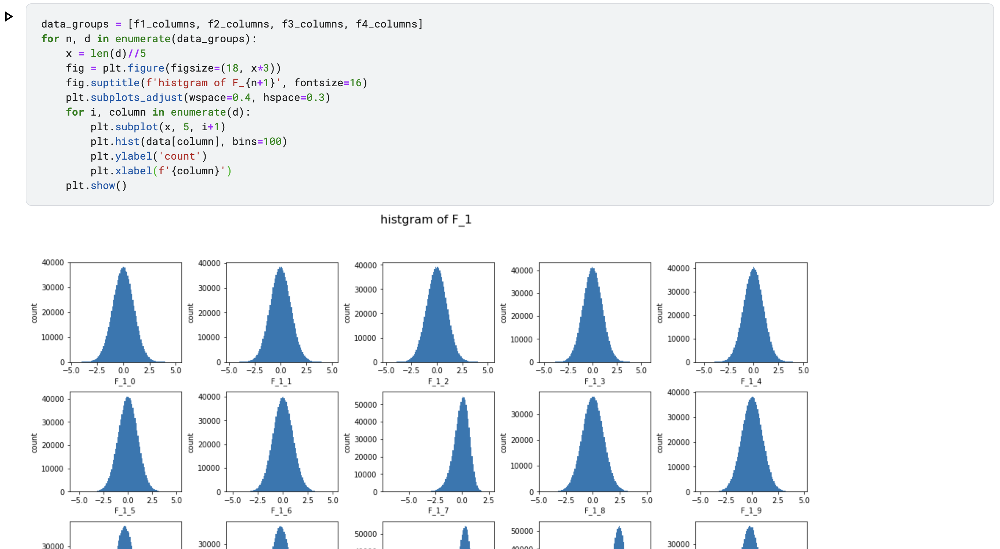
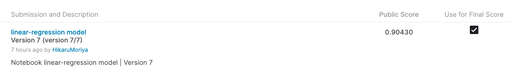
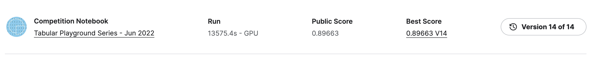
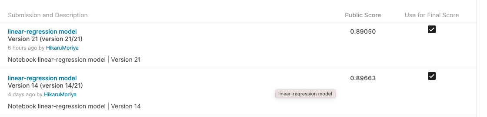
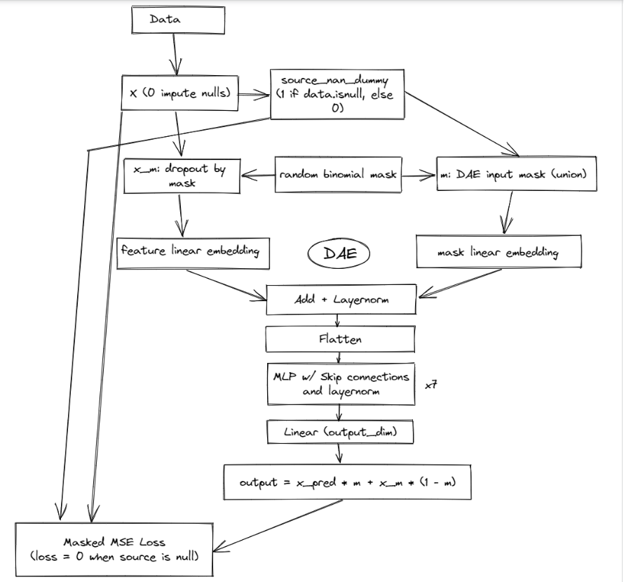

# Tabular Playground Series - Jun 2022
6月のPlaygroundシリーズは全てデータインピュテーション(代入法)についてです。代入法はデータ欠損値を代入して置き換える方法です。  
このデータセットは5月のPlaygroundに似ているが`target`がなくなっています。また、データセットには欠損値があるので、これらの値がどうあるべきか予測することです。


* 今月は欠損値を予測することが目的
* ノートブックの目的
    * データのインピュテーション(代入)

データセットが示唆するように、データには欠損値があり何らかの方法で欠損データをインピュテーションしなければならない。  
データセット内の欠損データを処理する方法はいくつかあり、簡単なインピュテーション方法を紹介したノートブックがたくさんある。
# Log

# 6/3

* データインピュテーション方法を説明したNotebook
    * https://www.kaggle.com/code/shtrausslearning/tps-model-based-imputation

このノートブックでは、異なるモデルのアンサンブルを含むモデルベースのインピュテーションのアプローチを見ていく。  
教師なし学習と教師あり学習の対象的なモデルを使用する。  
* データインピュテーションの種類
    (続きは後ほど記載)


# 6/4
* Discussion
    * https://www.kaggle.com/competitions/tabular-playground-series-jun-2022/discussion/328568
    * 様々なインピュテーションのテクニック
        * null値のある行を削除する
        * null度が高い特徴(カラム)を削除する
        * null値を平均値・中央値・その他の統計量に置換する
        * 半教師あり学習: 欠損データ代入問題の再定式化
        * 最尤推定量法
        * 多重代入法
        * ファンシーインピュテーション：MICE

# 6/5
* Disucussion
    * https://www.kaggle.com/competitions/tabular-playground-series-jun-2022/discussion/328369
    * 今回の課題はどのようなものか、どんな解決策が挙げられるか、コメントを通して探していくdiscussion

# 6/6
* 昨日のdiscussionの記事の続き
    * インピュテーションの方法として多くの有用な投稿が既にされている
    * インピュテーションのアプローチとは別に、これを回帰問題として扱い、それを解くというアプローチもある

回帰問題のアプローチでは一度に一つの列をターゲットとして考えて、他の列を使ってその列を予測しようとしている。  
たとえば、F_1_0列をターゲットとし、他の列を使ってこの列を予測するとする。欠損値は数値列にのみ存在するので予測するために回帰モデル構築する。各列について、その列の値が存在する全ての行を学習データセットとして、欠損列の値のテストデータセットとして取る事が出来る。`F_1_0`カラムのコード例は以下。
```python
df = pd.read_csv("/kaggle/input/tabular-playground-series-jun-2022/data.csv")
train_df = df[~df["F_1_0"].isna()]
test_df = df[df["F_1_0"].isna()]
```

そして訓練データを分割して回帰モデルを構築し評価できる。  
最終的に80のモデルを作成することになる。

# 6/7
* 欠損値を平均値で埋めてsubmitしてみる
    * 100万レコードある中で欠損値を埋める処理を実行しているので現在9時間半経過で6万7千件。。。。何日かかるのか。。
    * 

# 6/8
* 昨日の100万レコードのデータ
    * 時間超過でsubmitできず
    * 約9万件読み込んで12時間でタイムアウト
    * 
* 全てを平均値で代入したものを提出
    * 精度はだいぶ低い
    * 

# 6/9
* 現在Most VotesであるNotebookosを見て日本語訳してみる
* オリジナル記事 >> https://www.kaggle.com/code/abdulravoofshaik/quick-eda-and-missing-values-tutorial
* 日本語訳 >> https://www.kaggle.com/hikarumoriya/quick-eda-and-missing-values-tutorial/edit

# 6/12
* 日本語訳完成 >> https://www.kaggle.com/hikarumoriya/quick-eda-and-missing-values-tutorial/edit

* 回帰モデル作成途中にエラーが出て、「これを見たら良いかも」というようなメッセージが表示された。
    * imputation問題のチュートリアル
    * https://www.kaggle.com/code/dansbecker/handling-missing-values/notebook

# 6/14
* columnに統一性がある場合に有用なデータ分割方法

```python
data.columns

-----------------------------
Index(['row_id', 'F_1_0', 'F_1_1', 'F_1_2', 'F_1_3', 'F_1_4', 'F_1_5', 'F_1_6','F_1_7', 'F_1_8', 'F_1_9', 'F_1_10', 'F_1_11', 'F_1_12', 'F_1_13','F_1_14', 'F_2_0', 'F_2_1', 'F_2_2', 'F_2_3', 'F_2_4', 'F_2_5', 'F_2_6','F_2_7', 'F_2_8', 'F_2_9', 'F_2_10', 'F_2_11', 'F_2_12', 'F_2_13','F_2_14', 'F_2_15', 'F_2_16', 'F_2_17', 'F_2_18', 'F_2_19', 'F_2_20','F_2_21', 'F_2_22', 'F_2_23', 'F_2_24', 'F_3_0','F_3_1', 'F_3_2','F_3_3', 'F_3_4', 'F_3_5', 'F_3_6', 'F_3_7', 'F_3_8', 'F_3_9', 'F_3_10','F_3_11', 'F_3_12', 'F_3_13', 'F_3_14', 'F_3_15', 'F_3_16', 'F_3_17','F_3_18', 'F_3_19', 'F_3_20', 'F_3_21', 'F_3_22', 'F_3_23', 'F_3_24','F_4_0', 'F_4_1', 'F_4_2', 'F_4_3', 'F_4_4', 'F_4_5', 'F_4_6', 'F_4_7','F_4_8','F_4_9', 'F_4_10', 'F_4_11', 'F_4_12', 'F_4_13', 'F_4_14'],dtype='object')
-----------------------------


f1_columns = [c for c in data.columns if 'F_1' in c]
f2_columns = [c for c in data.columns if 'F_2' in c]
f3_columns = [c for c in data.columns if 'F_3' in c]
f4_columns = [c for c in data.columns if 'F_4' in c]
```



* 上記のf1~f4でそれぞれ学習したモデルを作成した。
* https://www.kaggle.com/code/hikarumoriya/linear-regression-model/edit

# 06/15
* 日本語のNotebooks
    * EDA with LGBM
    * 各特徴量(カラム)を具体的に分析している
    * 日本語なのでわかりやすい
    * https://www.kaggle.com/code/akioonodera/tps-jun2022-lgbm-regression

* 参考になりそうなので模写コーディング
* https://www.kaggle.com/hikarumoriya/eda-and-lgbm/edit

# 6/16
### 昨日の模写コーディング終了
学習時間が約6時間なので長い。optunaでパラメータを決めて一旦jsonファイルを作成する(dump)。dumpしたjsonファイルをfor文で回してトレーニングする。jsonファイルに格納されているoptunaで決めたパラメータを取り出してlgb.trainの引数としてパラメータを割り当てる。  
特徴量分処理するので長い。。  

* もう一つの[線形回帰モデル](https://www.kaggle.com/code/hikarumoriya/linear-regression-model)の結果を
    * 6/14に記載したやり方のモデル
    * f1~f4でそれぞれ学習したモデル
    * 

# 6/17
* JUNE 2022 TPS: Quick Overview
* わかりやすそうなので日本語訳する↓
* https://www.kaggle.com/code/desalegngeb/june-2022-tps-quick-overview
* https://www.kaggle.com/code/m1y7k8/tps-jun-2022-eda-imputation-interpolation

# 6/19
* 良Notebookの紹介
    * ここに載ってあるNotebookを一通り見てみる
    * https://www.kaggle.com/competitions/tabular-playground-series-jun-2022/discussion/328366

# 6/20、6/21、6/22
* 6/17で日本語訳したもの⇨ https://www.kaggle.com/code/hikarumoriya/tps-june-22-quick-overview-modelling-using-xgb/edit
* 6/17で日本語訳したもの⇨ https://www.kaggle.com/code/hikarumoriya/tps-jun-2022-eda-imputation-interpolation/edit

# 06/23
* Discussion
    * https://www.kaggle.com/competitions/tabular-playground-series-jun-2022/discussion/328369
    * 欠損値代入の方法として回帰を扱う。訓練データを分割して回帰モデルを構築し、各列に1つずつ合計80のモデルが作成される。
    * 「みんなの考えを投稿してください」↓↓
    * アプローチ一覧
        * F_2_nにLGBMを、それ以外に平均を適用したら良いスコアが出たらしい -> [notebook](https://www.kaggle.com/code/abdulravoofshaik/top-3-solution-lgbm-mean/notebook)
        * ベースとなる考え方 -> [notebook](https://www.kaggle.com/code/sanjaylalwani/tps-jun22-data-impute-lb-0-9?scriptVersionId=97733079)

# 6/24
* Discussionより

このコンペで提供されているデータセットが膨大なため、ほとんどのNotebookで処理するのに約20000秒かかっている(5~6時間)。プロセスを高速化する方法はあるのか？  
→ IterativeImputerのestimatorとしてXGBoostを使用する。（tree_methodパラメータを "gpu_hist "にすることを忘れずに。)
https://xgboost.readthedocs.io/en/stable/gpu/index.html） XGBoostはsklearnのMLアルゴリズムのようにCPUではなくGPUを使うので、非常に高速に動作する。  
→ コードの実行時間を追跡するマジックセルの`%%time`を使用するのもいい。

# 　6/25
* RMSE(平均平方二乗誤差)で評価しているが外れ値があると過剰に適合してしまい、精度を下げるかもしれないので外れ値を除く作業があってもいいかも
  * Notebookを見ていたところ異常値があって0.5%の外れ値を除外してみたが改善しなかったらしい
* 提出したNotebookの中で[精度の良いモデル](https://www.kaggle.com/code/hikarumoriya/linear-regression-model?scriptVersionId=99274273) の学習器でearly_stoppingを採用して提出してみる
  * 学習時間は大幅に減少すると思うが精度がどのくらい変わるのか見てみる

-> 0.01点スコアが上がったが、さほど変わりはない。ただ学習時間が半分くらいになっているので良い傾向にあると思われる。(6hour -> 3hour)


https://www.kaggle.com/code/hikarumoriya/linear-regression-model?scriptVersionId=99274273

# 6/26
* 歪度が高いものを補正する
    * 補正したら予測値がズレる気がする。。やめた方がいい
* Notebook
    * sklearnのsimpleImpute・ベイズ回帰・多項式回帰・Elastic Net(リッジ回帰、Lasso回帰)で学習させた予測値を合計して4で割った値で算出している
    * https://www.kaggle.com/code/imnaho/tps-jun22-eda-predict/notebook

* [現在使用しているNotebook](https://www.kaggle.com/code/hikarumoriya/linear-regression-model?scriptVersionId=99274273)に上記の各回帰を併用して合計して4で割ったものを算出してみる

# 6/27

* (公開されている)Notebook上で学習してoutputしたcsvファイルをダウンロードして、それを元に再学習するのもあり
* さまざまなモデルで予測した結果を合計して平均を出す方法を試している…

# 6/29
* 6/27の方法で試してみたところ精度が少し上がった
    * 
* n_estimator, num_boost_roundを2000回で試していたので4000回にあげてスコアが上がるか試す
    * スコアはあんまり変わらなかった

# 7/4
* TPS2022年06月振り返り
* 1位の人の解答がDiscussionで共有されていた
    * https://www.kaggle.com/competitions/tabular-playground-series-jun-2022/discussion/334331

### 1位の解答
今コンペの重要なポイントは、与えられた行で2つ以上の値が欠落しているF4の条件分布を推定することだった。これを解決するためにノイズ除去オートエンコーダを使った。これは欠落値の分布を推定するもの。F1とF3は平均推定してF2は完全に無視した(欠損値ないので)。
[Notebook(Pytorch実装)](https://www.kaggle.com/code/sebastianvangerwen/1st-place-solution-tps-jun-denoising-ae)  
以下にアーキテクチャの図面を掲載する。



### Random Mask
最初にデータを0でインプットし、元データのnullの位置を含むソースnullマトリクスを作成します。そして、二項ランダムマスク（各行が少なくとも1つの値を持つ）を作成し、元のデータと掛け合わせてランダムに値をゼロに設定します。このモデルは、マスクされたデータと入力マスクを受け取ります。入力マスクは、ソースnullベクトルとランダムマスクベクトルの組合せです。

### Feature-wise embeddings(特徴量に応じた埋め込み)
モデルっは特徴とマスクの両方を埋め込み、それらを足し合わせる。これはnullが0に設定されている場所の表現を学習するためで、どこに焦点を当ててインプットすれば良いかを学習することができる。
この方法は単にマスクされたデータにドロップアウトを適用するよりも遥かにいいパフォーマンスを発揮する。これらの埋め込みは入力ベクトルとマスクベクトルの各特徴を埋め込み次元(最終的には16次元)に線形射影し、それらを足し合わせて平坦化したものである。  

### MLPのアーキテクチャ
特徴量／マスクの埋め込みは、次にMLPを経由して送られます。スキップ接続でレイヤー正規化を行い、ミッシュ活性化関数を用いて7つの密なレイヤーを使用しました。レイヤーサイズが大きくなるとパフォーマンスが上がりますが、計算時間が問題になり、バッチサイズを大幅に減らさなければならなくなったため、2048のサイズまでしか試していません。

### 出力計算
MLPの出力を最終的に密な層を通して、入力形状と寸法を一致させるようにしています。そして、最終的な出力は、値がマスクされているかどうかが条件となります。値がマスクされていた場合は、最終的な密な層の出力を使用し、そうでない場合はモデルの入力だけを使用します。これにより、マスクされていない入力の勾配はMSE損失でゼロに等しくなり、ネットワークはマスクのインピュテーションへの寄与分のみをパラメータとして更新する。マスクの埋め込みと同様に、これはネットワークがインプットされるべき値に集中するのを助ける。

# マスクされたMSE損失
このステップは出力計算と非常に似ており、条件付きで損失関数をゼロに設定する別の方法である。ここでは、マスクに従って値をゼロにするMSEロスを使用した。このマスクは真のデータのヌル値です。したがって、もともと学習データにあった値については決して損失を計算しませんが、学習時にナイーブインピュテーション法を用いることで、偏りを生じさせることなくそれらの行から学習することができます。同様の方法がここでも使われています（データのヌル値で損失をゼロに設定するのと同じです）。このステップは修正出力計算の一部として含めることもできましたが、私はこのステップをトレーニング中にのみ含めたかったのです。そうしないと、実装は予測ステップ中にゼロのベクトルを渡す必要があります（少し不格好に感じますね）。

# 条件付きアンサンブル
DAEをpytorchとtensorflowで3回実行しました。tensorflowの実行はかなり良い結果を出しましたが、すべての平均が最も良い結果を出しました。このモデルは、プライベートLBで0.83351を記録しました。これを少し改善するために、F4の行ごとのNULL数が1のときだけ単一属性の予測実行をアンサンブルしました。この条件付きアンサンブルでは、プライベートLBのスコアは0.83343となりました。


* 1位のNotebookを模写コーディングする