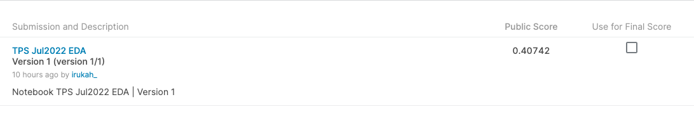

# Tabular Playground Series - Jul 2022
## 概要
この課題では、各行が特定のクラスタに属するデータセットが与えられます。目的は各行が属するクラスタを予測することです。訓練データを与えられていない且つグランドトゥルースラベルの中にいくつのクラスタがあるのかも教えられていない。教師なし学習である。

## 評価方法
提出データは真のクラスタラベルと予測したクラスタラベルの間の[Adjusted Rand Index](https://en.wikipedia.org/wiki/Rand_index)で評価される。この問題では、クラスタの数や学習ラベルは与えられない。

# log

# 7/4、7/5
* データの調査
* Notebooks
    * わかりやすそうなEDA
    * https://www.kaggle.com/code/kartushovdanil/tps-jul-22-advanced-2-sol

* 7/6
* Notebooks
    * 丁寧にEDAからクラスタリング・外れ値まで説明されている
    * https://www.kaggle.com/code/javigallego/outliers-eda-clustering-tutorial

# 7/7
* 7月のTPSは教師なし学習でクラスタリングを使用する方針がオーソドックスになる

# 7/12, 7/13
* BayesianGaussianMixtureを使ってモデリングした良記事があったので参考にしてNotebook作成
* https://www.kaggle.com/hikarumoriya/tps-jul2022-eda/edit
* 結果
    * 